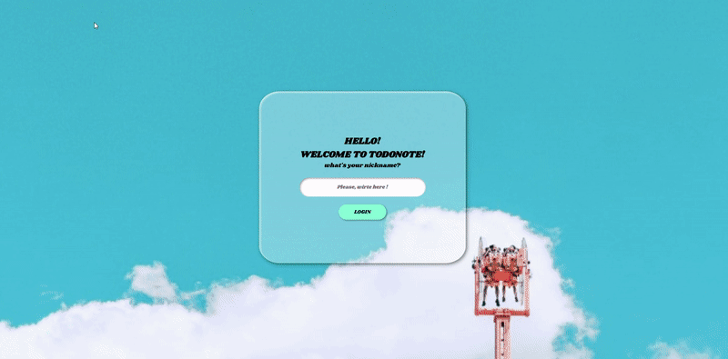

# TODO-LISt

## 프로젝트 목표 
1. 라이브러리를 이용하지 않고, Javascript만을 이용해 todolist를 만든다.
2. API를 이용해 외부의 데이터를 받아 화면에 구현시킨다.
3. Javascript에 대한 학습과 LocalStorage에 대해 학습한다.

### ✨ [Project Demo](https://anise-002.github.io/Todolist/)
<div> 
    
</div>

<br>

## 구현된 기능

> 1. local Storage를 이용한 로그인
> 2. Todolist 구현
> 3. API를 이용한 날씨와 명언
> 4. D-day 계산기

<br>

### 1. local Storage를 이용한 로그인
```javascript
const saveName = localStorage.getItem(USERNAME_KEY);
function submitHandler(event){
    event.preventDefault();
    loginCon.classList.add(HIDDEN);
    todolistCon.classList.remove(HIDDEN);
    localStorage.setItem(USERNAME_KEY, loginInput.value);
    todoUsername.innerText = loginInput.value;
    todolistCon.style.display = 'flex';    
}

if(saveName === null){
    loginForm.addEventListener("submit", submitHandler);
}else{
    todoUsername.innerText = saveName;
    loginCon.classList.add(HIDDEN);
    todolistCon.classList.remove(HIDDEN);
}

loginForm.addEventListener("submit", submitHandler);
```
+ input에 입력된 value의 값을 localStorage를 이용해 값을 저장합니다.
+ 저장된 userName은 todolist-content의 메인 타이틀로 사용되어집니다.

### 2. Todolist 구현
#### 할일을 입력 후 데이터 저장
```javascript
function submitHandler(e){
    e.preventDefault();
    const todoInputValue = todoInput.value;
    const todoObject = {
        text : todoInputValue,
        id : Date.now(),
    }
    todoInput.value = null;
    showHtml(todoObject);
    todoListArr.push(todoObject);
    saveToDo(todoListArr);
}

todoForm.addEventListener('submit',submitHandler);
```
+ input을 submit하면 입력된 value의 값을 객체로 만들어 todoListArr 배열에 저장합니다.
+ 값이 저장된 배열을 localStroge에 저장하여 윈도우가 꺼져도 데이터가 유지되도록 합니다.

#### localStorage에 데이터 저장
```javascript
function saveToDo(todo){
    localStorage.setItem(TODO_KEY, JSON.stringify(todo));
} 
```
+ 데이터를 담고 있는 todoListArr 배열을 JSON.stringify()메서드를 이용해 배열을 그대로를 문자 타입으로 변환시켜 값을 localStorage에 저장합니다.

#### 제출된 데이터를 화면에 구현
```javascript
function showHtml(todo){  
    //li 생성
    const li = document.createElement('li');
    li.id = todo.id;
    li.innerHTML = `<div>${todo.text}</div>`;
    //checkBox span 생성
    const checkBox = document.createElement('span');
    checkBox.innerHTML = `<i class="fas fa-check"></i>`;
    // delete span 생성
    const span = document.createElement('span');
    span.classList.add('color');
    span.innerHTML = `<i class="fas fa-minus-circle"></i>`;
    //조합
    li.prepend(checkBox);
    li.appendChild(span);
    todoList.appendChild(li);
}
```

#### 추가 기능 : 체크박스(라인그리기), 할일 삭제 기능

```javascript
function drawingLine(e){
        const text = e.target.parentElement.parentElement;
        const checkBox = e.target.parentElement;
        if(text.classList.contains(LINE_THROUGH)){
            text.classList.remove(LINE_THROUGH);
            todoListArr.forEach(function(element){
                if(element.id === parseInt(text.id)){
                    element.class = "";
                }
            }); 
            saveToDo(todoListArr);
            checkBox.classList.remove(NOCOLOR); 
        }else{
            text.classList.add(LINE_THROUGH);
            todoListArr.forEach(function(element){
                if(element.id === parseInt(text.id)){
                    element.class = LINE_THROUGH;
                }
            });        
            checkBox.classList.add(NOCOLOR);
            saveToDo(todoListArr);
        }
    }
```
추가된 todolist에 체크박스 버튼을 클릭하면, 타겟이 된 todolist에 `LINE_THROUGH`클래스 여부에 따라 class명을 가진 프로퍼티의 값을 변경하여, 취소선이 그려지도록 구현하였습니다.

```javascript
    function deleteHnadler(e){
        const li = e.target.parentElement.parentElement;
        const newArr = todoListArr.filter((item) => item.id !== parseInt(li.id));
        todoListArr = newArr;
        saveToDo(todoListArr);
        li.remove();
    }
```
삭제 버튼을 클릭하면 클릭한 todolist의 id값과 일치한 요소를 뺀 나머지 요소들을 `filter()`를 이용해 클릭된 요소가 없는 새로운 배열을 만듭니다. 새로 만들어진 배열을 다시 localStorage에 저장해, localStorage에서 데이터가 삭제됩니다.

<br>
<br>

### 3. API를 이용한 날씨와 명언
#### 사용자의 위치에 따른 날씨 API
[OpenWeather](https://openweathermap.org/api)
```javascript
function success(position){
        const lat = position.coords.latitude;
        const lon = position.coords.longitude;
        const url = `https://api.openweathermap.org/data/2.5/weather?lat=${lat}&lon=${lon}&appid=${API_KEY}&units=metric`
        fetch(url)
            .then((response) => response.json())
            .then((data)=> {
            const weather = data.weather[0].description;
            const city = data.name;
            const tempMax = data.main.temp_max;
            const tempMin = data.main.temp_min;
            const IconNum= data.weather[0].icon;
            const iconUrl = `http://openweathermap.org/img/wn/${IconNum}@2x.png`;
            weatherImg.src = iconUrl; 
            currentCity.innerText = city;
            weatherText.innerText = weather;
            tempText.innerText = `${tempMax}°C / ${tempMin}°C`;
        });
    }
    function error(){
        errorText.innerText = `I couldn't find where you live.`;
    }
    
    navigator.geolocation.getCurrentPosition(success ,error);
```
+ navigoator를 이용해 현재 위치를 받습니다.
+ 받은 데이터를 통해 OpenWeather API의 데이터를 fetch메서드를 이용해 API데이터를 받고 화면에 구현합니다.

<br>

#### 명언 API
[Adivice Slip JSON API](https://api.adviceslip.com/)
```javascript
    function setAdvise(){
        let random = Math.floor(Math.random() * 100);
        console.log(random);
        const url = `https://api.adviceslip.com/advice/${random}`;
        fetch(url)
        .then((response) => response.json())
        .then((data)=>{
            let getAdvice = data.slip.advice;
            title.innerText = getAdvice;
        })
    }
```
+ Open Weather API와 같이 fetch메서드를 이용해 데이터를 받고, 화면으로 구현합니다.

## 개선사항
1. 반응형으로 제작
2. localStorage가 아니라, 외부 서버에 저장하는 방법으로 개선

## 프로젝트를 제작하면서
 이번 프로젝트는 Javascript를 이용해 LogalStorage에 데이터와 외부의 데이터(API)를 받아 화면으로 구현하는 방법과 JSON 형태의 데이터를 공부할 수 있었던 기회였습니다. 아직 다양한 API를 접하지 않아, API를 다루는 것에 서툴 수 있으나, 이번 프로젝트를 통해 감을 익힌 것 같아 좋은 시간이었습니다. 그리고 Javascript를 이용해 다양한 기능을 구현하고, 구현된 기능의 오류를 접할 수 있어, 고려할 사항에 대해 조금이나마 맛 볼 수 있는 시간이 되었던 것 같습니다.

 이 프로젝트를 시작으로  Javascript를 이용한 다양한 활용을 공부하고, 그 외에 Javascrip의 라이브러리를 익혀 활용성을 높일 수 있도록 공부할 것 입니다.
